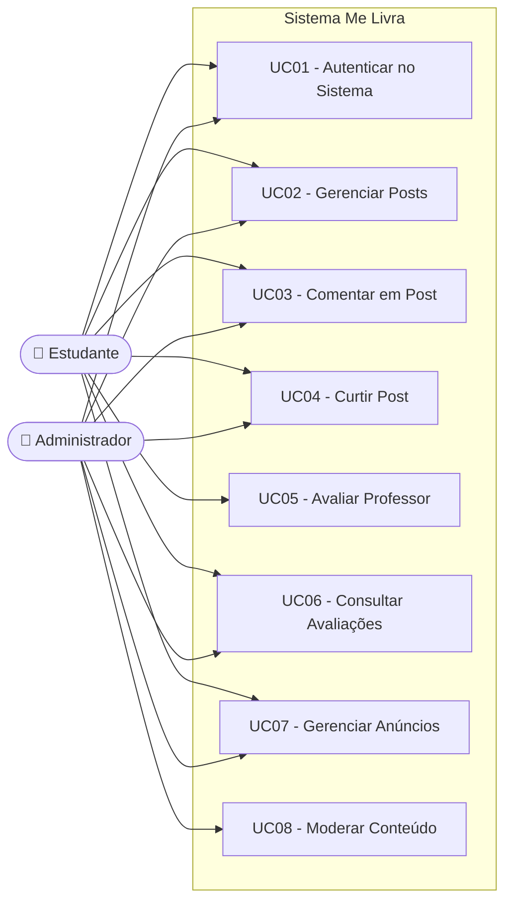

# 03 — Casos de Uso

## 1. Atores

| Ator | Descrição |
|------|-----------|
| **Estudante** | Usuário comum da plataforma. Pode criar posts, comentar, curtir, avaliar professores e publicar anúncios. |
| **Administrador** | Usuário com privilégios de moderação. Pode realizar todas as ações do Estudante e, adicionalmente, remover qualquer conteúdo impróprio do sistema. |

---

## 2. Tabela de Casos de Uso

| ID | Nome | Ator Principal | Descrição |
|----|------|---------------|-----------|
| UC01 | Autenticar no Sistema | Estudante, Administrador | O usuário informa e-mail e senha para acessar a plataforma. O sistema valida as credenciais e concede acesso. |
| UC02 | Gerenciar Posts | Estudante, Administrador | O usuário pode criar, editar, excluir e listar posts textuais na plataforma. |
| UC03 | Comentar em Post | Estudante, Administrador | O usuário seleciona um post existente e adiciona um comentário textual. |
| UC04 | Curtir Post | Estudante, Administrador | O usuário registra uma curtida em um post, incrementando seu contador. |
| UC05 | Avaliar Professor | Estudante | O estudante seleciona um professor cadastrado, atribui uma nota de 0 a 10 e escreve um comentário sobre o docente. |
| UC06 | Consultar Avaliações de Professor | Estudante, Administrador | O usuário visualiza todas as avaliações de um professor e sua nota média calculada. |
| UC07 | Gerenciar Anúncios | Estudante, Administrador | O usuário pode criar, editar, excluir e listar anúncios universitários com título, descrição e preço. |
| UC08 | Moderar Conteúdo | Administrador | O administrador remove posts, comentários ou anúncios que violem as regras da plataforma. |

---

## 3. Diagrama de Casos de Uso

---

## 4. Descrição Detalhada dos Casos de Uso Principais

### UC01 — Autenticar no Sistema
- **Pré-condição:** Usuário já está cadastrado no sistema.
- **Fluxo principal:** Usuário informa e-mail e senha → Sistema valida → Acesso concedido.
- **Fluxo alternativo:** Credenciais inválidas → Sistema exibe mensagem de erro.

### UC05 — Avaliar Professor
- **Pré-condição:** Estudante autenticado; professor cadastrado no sistema.
- **Fluxo principal:** Estudante seleciona professor → Informa nota (0–10) e comentário → Sistema registra avaliação e atualiza média.
- **Regra de negócio:** A nota deve estar no intervalo [0, 10].

### UC08 — Moderar Conteúdo
- **Pré-condição:** Administrador autenticado; conteúdo existente no sistema.
- **Fluxo principal:** Administrador localiza o conteúdo impróprio → Solicita remoção → Sistema remove e confirma.
