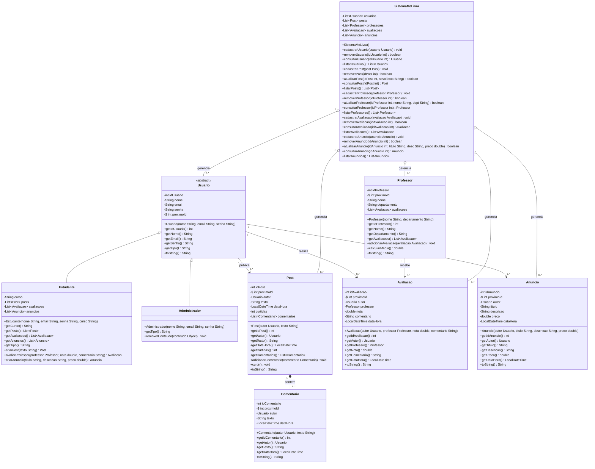
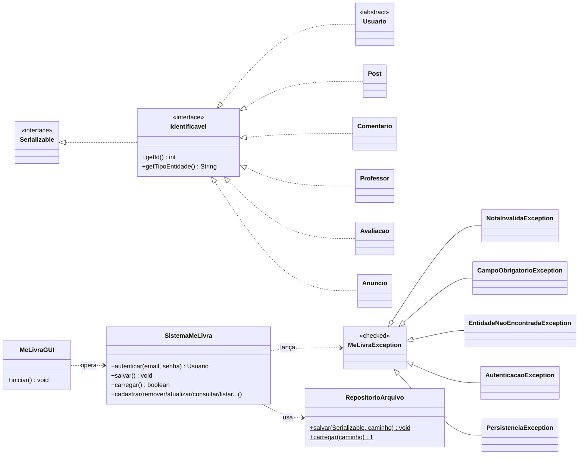

# 05 — Diagrama de Classes

## 1. Diagrama UML

---

## 2. Decisões de Modelagem

**Classe Abstrata `Usuario`:** A escolha de tornar `Usuario` abstrata reflete o fato de que nenhum usuário pode existir no sistema sem ser, concretamente, um `Estudante` ou um `Administrador`. O método abstrato `getTipo()` força cada subclasse a se identificar, permitindo polimorfismo na exibição de informações. O atributo `static int proximoId` garante a geração de identificadores únicos e sequenciais sem depender de banco de dados, atendendo ao RNF04.

**Herança `Estudante` e `Administrador`:** A herança é justificada pela relação "é-um" (um Estudante *é um* Usuário). As listas de `Post`, `Avaliacao` e `Anuncio` foram colocadas em `Estudante` porque somente o usuário comum realiza essas ações com rastreio individual; o `Administrador` opera de forma transversal via `SistemaMeLivra`.

**Composição `Post` → `Comentario`:** Comentários têm existência dependente do post ao qual pertencem — se o post for removido, seus comentários não fazem sentido isolados. Por isso a relação é de composição (`*--`), e não de simples associação.

**Associação `Professor` → `Avaliacao`:** Professor e Avaliação existem de forma independente; um professor pode ter zero avaliações e ainda assim ser um objeto válido. Portanto, a relação é de associação (`-->`), com o professor mantendo uma lista das avaliações que recebe e o método `calcularMedia()` percorrendo essa lista dinamicamente.

**Classe `SistemaMeLivra`:** Atua como repositório central (padrão *Repository*), agregando todas as entidades com agregação (`o--`), pois as entidades podem existir conceitualmente fora do sistema. Os métodos CRUD seguem nomenclatura uniforme (`cadastrar`, `remover`, `atualizar`, `consultar`, `listar`), facilitando a manutenção e a evolução do sistema.

---

## 3. Arquitetura da Entrega Final

A entrega final acrescentou a interface `Identificavel`, a hierarquia de
exceções próprias e as camadas de persistência e serviço. A organização em
pacotes ficou assim:

### Pacotes (responsabilidade)

| Pacote | Conteúdo |
|--------|----------|
| `br.com.melivra.model` | Entidades de domínio + interface `Identificavel` |
| `br.com.melivra.exception` | Exceção base `MeLivraException` e exceções específicas |
| `br.com.melivra.persistence` | `RepositorioArquivo` (serialização em arquivo) |
| `br.com.melivra.service` | `SistemaMeLivra` (CRUD + persistência + autenticação) |
| `br.com.melivra.ui` | `MeLivraGUI` (interface gráfica com `JOptionPane`) |
| `br.com.melivra.util` | `Formatador` (utilitários de formatação) |
| `br.com.melivra.test` | `TesteFuncional` (casos de teste) |

### Decisões da entrega final

- **Interface `Identificavel`:** unifica o contrato de "ter ID" e "saber se
  rotular", permitindo que a GUI e a moderação tratem qualquer entidade de forma
  polimórfica. Estende `Serializable` porque toda entidade é persistida.
- **Exceção própria `NotaInvalidaException`:** materializa a regra de negócio
  "nota entre 0 e 10" (requisito h), substituindo o *clamp* silencioso da
  primeira entrega por uma falha explícita e informativa.
- **Persistência por serialização:** o `SistemaMeLivra` grava um único
  instantâneo (`EstadoSistema`) com todas as listas e os contadores estáticos,
  preservando a identidade das referências cruzadas entre objetos e permitindo
  retomar a numeração de IDs sem colisão.
